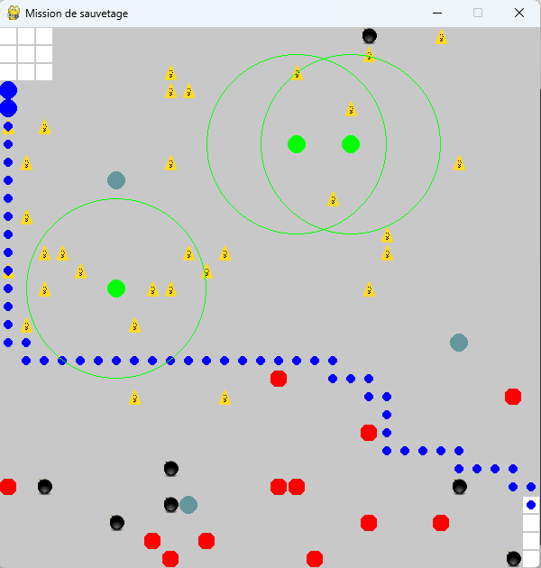
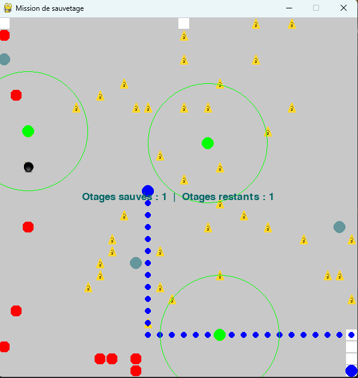
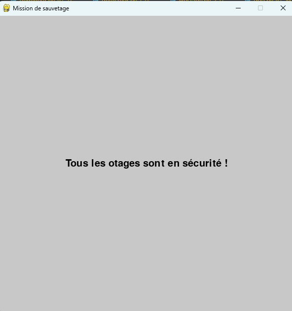
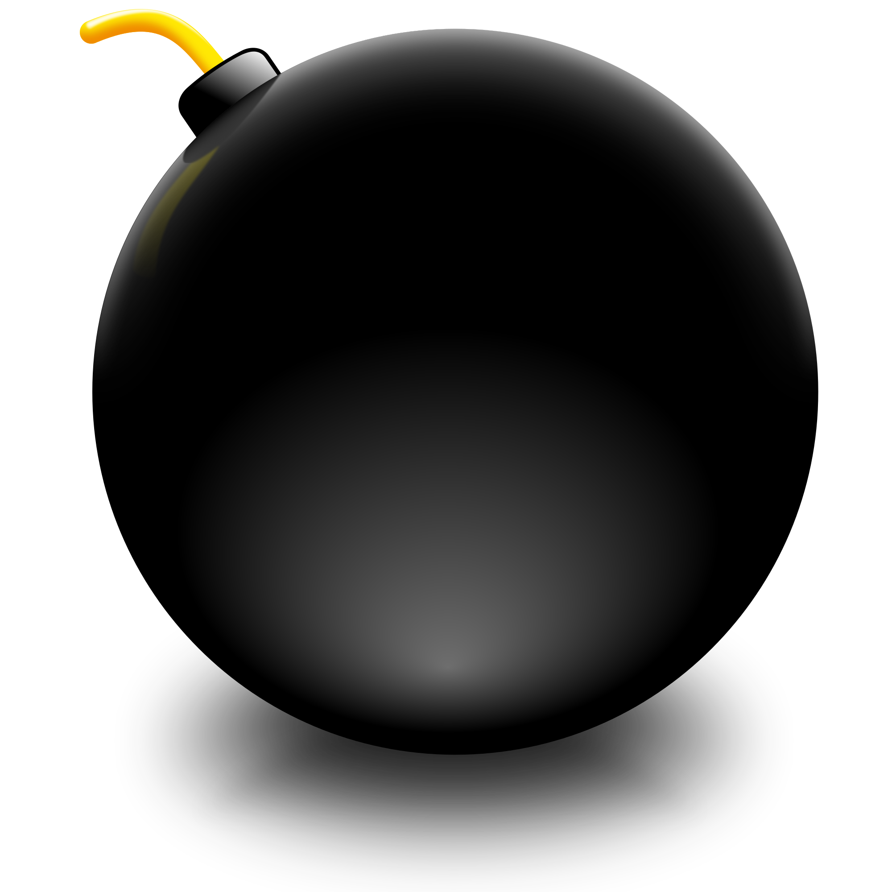
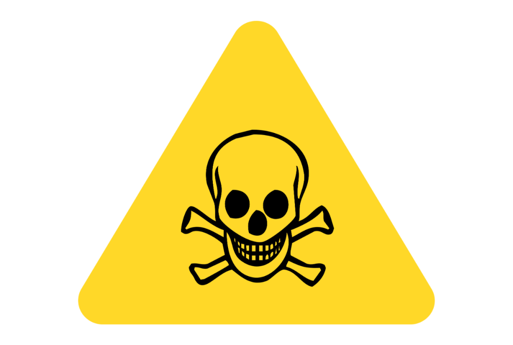

# PROJET : Simulation d'un Terrain de Mines de Guerre avec une Architecture Multi-Agent

## Introduction
Ce projet simule un terrain de mines de guerre où des agents doivent traverser un champ miné en utilisant des algorithmes d'IA pour détecter, désamorcer des mines et trouver des chemins sûrs. L'objectif est de coordonner différents types d'agents pour réussir la mission de sauvetage.


### Contexte
Ce projet simule un terrain de mines de guerre, où des agents otages doivent traverser de manière sécurisée depuis une position initiale jusqu'à la position finale du terrain. Le terrain est parsemé de mines, et les agents détecteurs, démineurs et otages doivent coopérer pour garantir la sécurité des otages.

Les détecteurs, ne disposant pas de connaissances omniscientes, trouvent aléatoirement les positions des mines. Ils transmettent ces informations cruciales aux démineurs et aux otages. Les démineurs, opérant dans un rayon d'activité prédéfini, localisent et désamorcent les mines, puis communiquent les positions des mines désamorcées aux otages.

Les otages utilisent l'algorithme A* pour déterminer un chemin sûr, en considérant les positions des mines découvertes et non désamorcées comme des obstacles à éviter. Lorsqu'une mine est désamorcée, les otages recalculent leur chemin en intégrant les nouvelles informations de terrain. L'objectif global est de permettre aux otages de traverser intelligemment le terrain miné, en prenant en compte les changements dynamiques de l'environnement.

### Objectifs communs :
   - Les otages doivent traverser le terrain en toute sécurité.
   - Les détecteurs doivent localiser toutes les mines.
   - Les démineurs doivent désamorcer les mines dans leur rayon d'activité.

### Les rôles et les responsabilités :
   Dans le projet de simulation du terrain de mines de guerre avec une architecture multi-agent, les différents agents sont classés en trois types principaux : les otages, les détecteurs et les démineurs. Voici une description détaillée de chaque type d'agent, leur rôle et leur type selon les classifications des agents en intelligence artificielle :

#### 1. Otages  

**Type : Agents basés sur un but**

**Rôle :**
- Traverser le terrain de mines en toute sécurité.
- Utiliser l'algorithme A* pour trouver des chemins sûrs vers la destination finale.
- Prendre en compte les positions des mines détectées et désamorcées pour ajuster leur chemin.
- Recevoir des informations des démineurs et des détecteurs pour éviter les zones dangereuses.
    
#### 2. Détecteurs
**Type : Agents observateurs**

**Rôle :**
- Parcourir le terrain pour détecter les positions des mines.
- Transmettre les positions des mines découvertes aux démineurs et aux otages.
- Aider à cartographier le terrain pour faciliter les déplacements des autres agents.
- Jouer un rôle crucial dans l'identification des menaces avant qu'elles ne deviennent un danger pour les otages.

 #### 3. Démineurs
**Type : Agents réflexes et agents basés sur l’utilité**

**Rôle :**
- Désamorcer les mines trouvées par les détecteurs.
- Communiquer les positions des mines désamorcées aux otages pour indiquer que ces zones sont sûres.
- Déplacer stratégiquement sur le terrain pour maximiser leur efficacité dans le désamorçage des mines.
- Coopérer avec d'autres démineurs pour assurer une couverture maximale et minimiser les risques.
    
#### Résumé des rôles et types
- **Otages :** Agents basés sur un but. Leur objectif est de traverser le terrain de mines en utilisant des informations pour éviter les mines et trouver un chemin sûr.
- **Détecteurs :** Agents observateurs. Leur rôle est de détecter les mines et de communiquer ces informations aux autres agents pour assurer leur sécurité.
- **Démineurs :** Agents réflexes et basés sur l’utilité. Leur fonction principale est de désamorcer les mines et de signaler les zones sécurisées aux otages.

 

### Mécanismes de communication :
   - Utilisation des messages pour la communication des positions des mines entre les agents.
   - Mise en place un protocole pour la notification des positions désamorcées.

### Algorithmes de coordination :
   - Utilisation A* pour la recherche de chemin par les otages.
   - Implémentation un algorithme pour la détection et la désactivation des mines par les détecteurs et démineurs.
   - Mise à jour les chemins en fonction des changements de terrain.

## Structure
```
Project
    │   
    │───classe
    |    │──agent.py
    |    │──demineur.py
    |    │──detecteur.py
    |    └──Hostage.py
    |
    │───utils
    |    |__utils.py
    |    |__settings.py
    |   
    │───grid.py
    |    
    └───main.py
```         

### Image de simulation




L'image fournie montre la simulation du terrain de mines. Les différents éléments représentés sont :

-  Points noirs : Mines non détectées
- Points bleus : Démineurs
- Points verts : Chemin des otages
- Points rouges : Mines détectées et non désamorcées
-  Panneaux jaunes : Mines détectées et désamorcées

## Conclusion
Cette simulation utilise une architecture multi-agent pour modéliser et résoudre le problème de traversée d'un champ de mines en coordonnant des agents avec des rôles spécifiques. Les algorithmes d'IA tels que A* sont utilisés pour la recherche de chemins sûrs, et les communications entre agents permettent de mettre à jour les informations critiques sur le terrain de manière dynamique.
